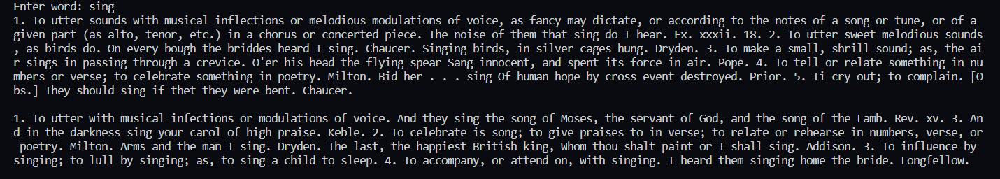
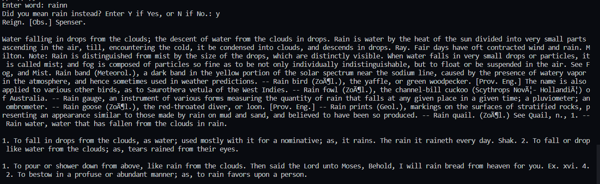

# EnglishDictionaryPython
English dictionary using Python

Taking input word from user:

If entered wrong input, suggesting related words:

Dictionary source: Webster's Unabridged Dictionary (https://www.gutenberg.org/ebooks/29765)
